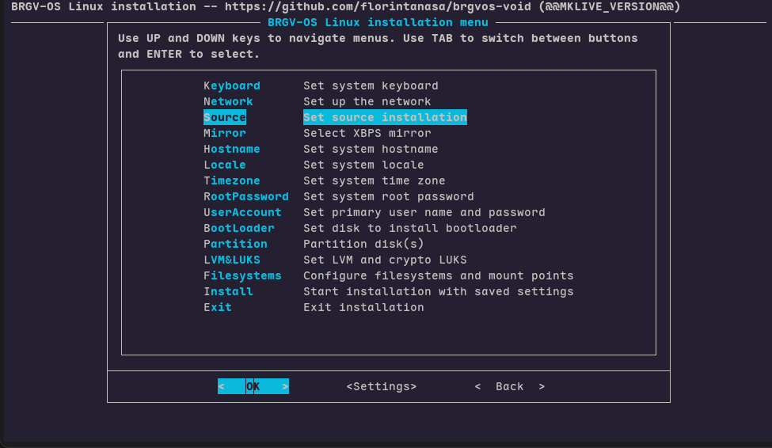
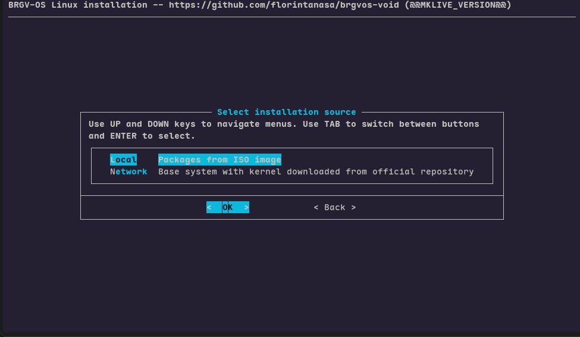
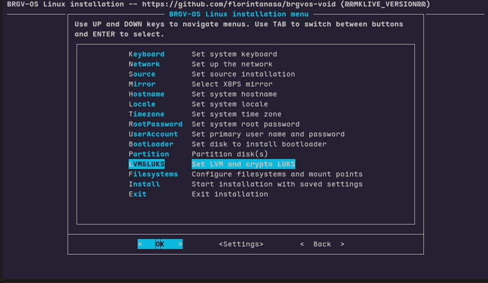
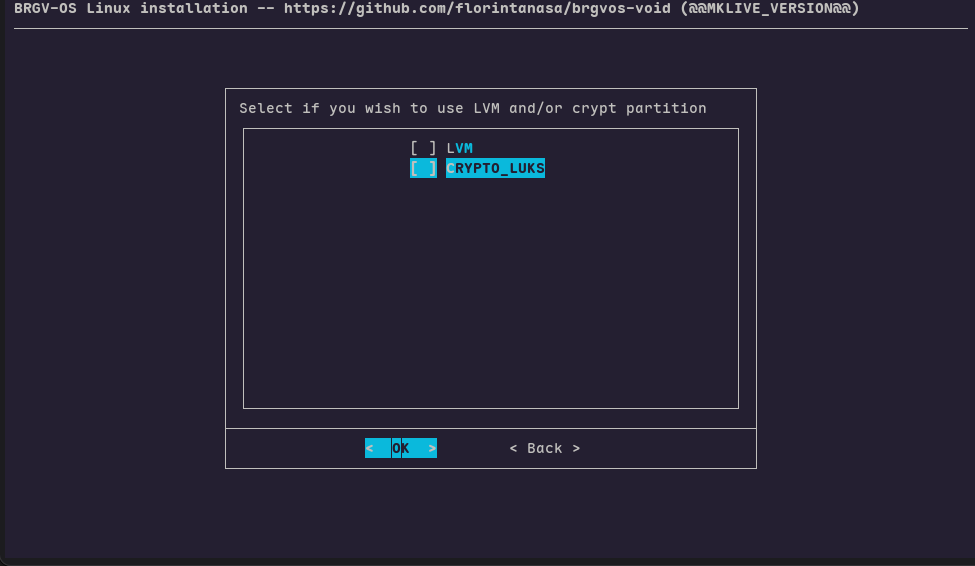
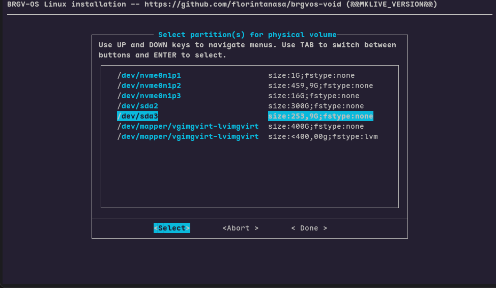
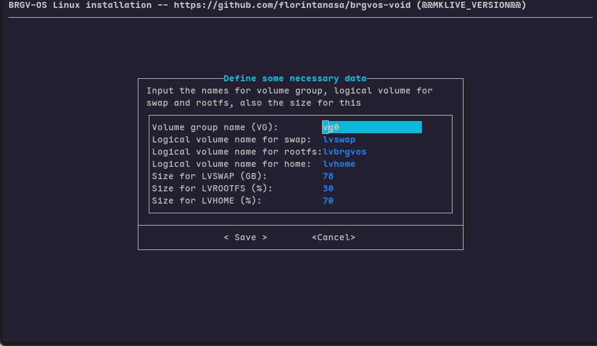

# brgvos-installer
BRGV-OS Linux installer implemented in GNU Bash.  
[BRGV-OS](https://github.com/florintanasa/brgvos-void) is a spin Void Linux distribution.  

The brgvos-installer installer is a spin of the [Void Linux installer](https://github.com/void-linux/void-mklive) to which have made some changes and added new
features.  

The main function is to install the BRGV-OS live system, located on the CD, as well as to install a minimal functional
system (base system) of Void Linux together with kernel6.12.

|                       Source menu                       |                      Source options menu                       |
|:-------------------------------------------------------:|:--------------------------------------------------------------:|
|  |  |

The installer provides the following installation modes:
* LVM installation; 
* Full encrypted installation;
* LVM with full encrypted installation;
* Classic partitioned installation;
* Combinations from these.

|                                   LVM&LUKS menu                                   |                             LVM&LUKS options                             |
|:---------------------------------------------------------------------------------:|:------------------------------------------------------------------------:|
|                 |  |


|                               LVM select partition                                |                            Define LVM data                             |
|:---------------------------------------------------------------------------------:|:----------------------------------------------------------------------:|
|  |  |
## 

> [!IMPORTANT]  
> To make partitions on used disks is better to use `fdisk` utility, `cfdisk` is easier but not delete signatures 
> for LVM & LUKS if exist from over installation. 
  
## Define LVM data
To explain the parameters from `Define some necessary data` form:  
1. Volume group name (VG): - is the name for volume group, have default value `vg0`;
2. Logical volume name for swap: - is the name for the logical volume use for swap , have default value `lvswap`;
3. Logical volume name for rootfs: - is the name for the logical volume used for rootfs `/`, have default value `lvbrgvos`;
4. Logical volume name for home: - is the name for the logical volume use for home `/home` , have default value `lvhome`;
5. Size for LVSWAP (GB): - is the space, in GB, allocated for logical volume used for swap, default value is `2*RAM`;
6. Size for LVROOTFS (%): - is the space, in percentages, allocated for logical volume used for rootfs `/`, default is `30`;
7. Size for LVHOME (%):- is the space, in percentages, allocated for logical volume used for home `/home`, default is `70`;

For the **names** is possible to use any alphanumeric characters and `-`, without special characters and space.
For the **size** we look on next algorithm used in script:
```bash
# Create logical volume for swap and rootfs
      if [ "$_slvswap" -gt 0 ]; then # If user enter a size for swap logical volume create this lvswap
        lvcreate --yes --name "$_lvswap" -L "$_slvswap"G "$_vgname"
      fi
      # Calculate some variables needed for _slvrootfs and _slvhome
      _FREE_PE=$(vgdisplay $_vgname | grep "Free  PE" | awk '{print $5}')
      _PE_Size=$(vgdisplay $_vgname | grep "PE Size" | awk '{print int($3)}')
      echo "_FREE_PE=$_FREE_PE"
      echo "_PE_Size=$_PE_Size"
      _FREE_PE=$((_FREE_PE-2)) # subtract 2 units, it is possible to give an error for 100% (rounded to the whole number)
      if [ "$_slvhome" -gt 0 ] ; then # If user enter a size for home logical volume
         # Convert _slvhome from percent to MB
        _slvhome_MB=$(((_FREE_PE*_PE_Size*_slvhome)/100))
        lvcreate --yes --name "$_lvhome" -L "$_slvhome_MB"M "$_vgname"
        echo "_slvhome_MB=$_slvhome_MB"
      fi
      if [ "$_slvhome" -eq 0 ] ; then # If user not enter a size for home logical volume make lvrootfs xxx% from Free
        lvcreate --yes --name "$_lvrootfs" -l +"$_slvrootfs"%FREE "$_vgname"
      elif [ "$_slvrootfs" -gt 0 ]; then # If user enter a size for rootfs logical volume create this lvrootfs
        # Convert _slvrootfs from percent to MB
        _slvrootfs_MB=$(((_FREE_PE*_PE_Size*_slvrootfs)/100))
        lvcreate --yes --name "$_lvrootfs" -L "$_slvrootfs_MB"M "$_vgname"
        echo "_slvrootfs_MB=$_slvrootfs_MB"
      fi
```

The input field for `Size for LVSWAP (GB)`, can have any value greater then `0`, otherwise is not created and the space revenue 
to the next logical volumes `lvhome` and `lvbrgvos`.  
The input field for `Size for LVHOME (%)`, can have any value greater then `0`, otherwise is not created and the space revenue
to the next logical volume `lvbrgvos`.
The input field for `Size for LVROOTFS (%)`, can have any value greater `0`, otherwise is not created.

Next tables is more explicative for:
* Size for LVSWAP (GB):  `6`  
* Size for LVROOTFS (%): `30`  
* Size for LVHOME (%):   `70`  

Usually we use in calculus (integer) the size of the disks in GB (is "commercial" size):

| SSD_1 | SSD_2 | Total VG | LVSWAP | FREE SPACE | LVHOME | LVROOTFS |
|:-----:|:-----:|:--------:|:------:|:----------:|:------:|:--------:|
| 250GB | 250G  |  500GB   |  6GB   |   494GB    | 345GB  |  148GB   |

But in algorithm is used `FREE PE` (**P**hysical **E**xtent) an this have typically **4MB**, so for a disk we have:  
(250/4)*1024=64000 `FREE PE` (consider disk unused).  

> [!IMPORTANT]  
> From Free PE, after is created `lvswap`, subtract 2 units to have a safety marje

| SSD_1 | SSD_2 | Total VG | LVSWAP | FREE SPACE | LVHOME | LVROOTFS |
|:-----:|:-----:|:--------:|:------:|:----------:|:------:|:--------:|
| 64000 | 64000 |  128000  |  6GB   |   126462   | 88523  |  37938   |

Also, in algorithm, **PE** is converted in **MB**:

| SSD_1 | SSD_2 | Total VG | LVSWAP | FREE SPACE |  LVHOME  | LVROOTFS |
|:-----:|:-----:|:--------:|:------:|:----------:|:--------:|:--------:|
| 64000 | 64000 |  128000  |  6GB   |   126462   | 354093MB | 151754MB |

and result in **GB**:

| SSD_1 | SSD_2 | Total VG | LVSWAP | FREE SPACE | LVHOME | LVROOTFS |
|:-----:|:-----:|:--------:|:------:|:----------:|:------:|:--------:|
| 64000 | 64000 |  128000  |  6GB   |   126462   | 345GB  |  148GB   |

If `LVSWAP` is `0`, all spaces are shared by `LVHOME` and `LVROOTFS`, in their percentages, and if `LVHOME` is also `0`,
all the spaces are allocated in percentages to `LVROOTFS`.

## Video examples
Because an image say more like 1000 words, next is some video examples, so this make many, many words :)  

| BRGV-OS install on LVM in HDD                                                                                                 |                                                                                                                                      |
|:------------------------------------------------------------------------------------------------------------------------------|:------------------------------------------------------------------------------------------------------------------------------------:|
| Source: `Local`</br>LVM&LUKS: `LVM`</br>LVSWAP (GB): `14`</br>LVROTFS (%): `30`</br>LVHOME (%): `70`</br>Filesystems: `btrfs` | [](https://www.youtube.com/embed/8uVmGKrpThI?autoplay=1&mute=1) |

|                                               BRGV-OS install in SSD encrypted and LVM                                               |                                                                                                                                      |
|:------------------------------------------------------------------------------------------------------------------------------------:|:------------------------------------------------------------------------------------------------------------------------------------:|
| Source: `Local`</br>LVM&LUKS: `LVM`+`LUKS`</br>LVSWAP (GB): `14`</br>LVROTFS (%): `30`</br>LVHOME (%): `60`</br>Filesystems: `btrfs` | [](https://www.youtube.com/embed/bk30gESYeJU?autoplay=1&mute=1) |

|      BRGV-OS install on tty console in SSD and HDD       |                                                                                                                                      |
|:--------------------------------------------------------:|:------------------------------------------------------------------------------------------------------------------------------------:|
| Source: `Local`</br>LVM&LUKS: `NO`</br>Filesystems: `ext4` | [](https://www.youtube.com/embed/dD8Q4JN7lYw?autoplay=1&mute=1) |

|                                        Void Linux install with brgvos-installer on LVM                                         |                                                                                                                                      |
|:------------------------------------------------------------------------------------------------------------------------------:|:------------------------------------------------------------------------------------------------------------------------------------:|
| Source: `Network`</br>LVM&LUKS: `LVM`</br>LVSWAP (GB): `0`</br>LVROTFS (%): `30`</br>LVHOME (%): `70`</br>Filesystems: `btrfs` | [](https://www.youtube.com/embed/x9IMfU4ZXuw?autoplay=1&mute=1) |

Is usable (was tested with BRGV-OS live image), with attention, I will back soon with more info...
# Work is in progress...